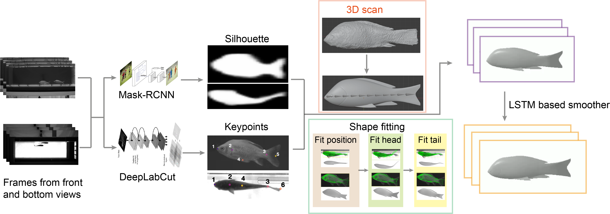

# Accurate 4D shape reconstruction of schooling fish



## Instructions
To prepare the working environment:
```
virtualenv .3dr_env -p python3
source .3dr_env/bin/activate
pip install -r requirements.txt
```

We use PyTorch3D to render mesh silhouette during training. 
Please follow the installation guide in their official repository
https://github.com/facebookresearch/pytorch3d/blob/main/INSTALL.md

### prepare dataset
Extract frames from videos:
```
python3 video_processing/extract_frames.py  [-v VIDEOS [VIDEOS ...]] [-o OUTPUT_DIR]
```
Running this script will process each video specified in [VIDEOS]
and save frames of each video to a separate sub-folder in OUTPUT_DIR.
A json file contains the result information is created under OUTPUT_DIR.
In each sub-folder, an index file in csv format is used to store

`
'frame', 'file_loc', 'category', 'sub_index', 'folder'
`

## Usage
The reconstruction requires a keypoint detection result and masks for fish. 
Please define the custom keypoint as in [fish_model.py](animal_model/fish_model.py) 
and data loader as the class 'Multiview_Dataset' in [MaskDatasets.py](animal_model/MaskDatasets.py)

We provide our detected keypoint and detected mask in the following link for a quick demo: 
https://drive.google.com/drive/folders/1zu_Quqs1z1q5YhbxWOWcdSVfNgT_RKs1?usp=sharing

Extract the file will create a folder 'data' at the root of this repository.
The input folder path will be 'data/input/demo'

To reconstruct from multi-view data:
```
python3 multiview_reconstruction.py --index 800 801 802 803 
                                    --mesh [path to model file in json format]
                                    --datadir [path to input folder]
                                    --outdir [path to output folder]
```